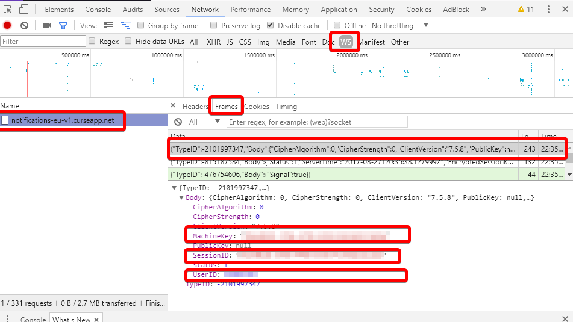
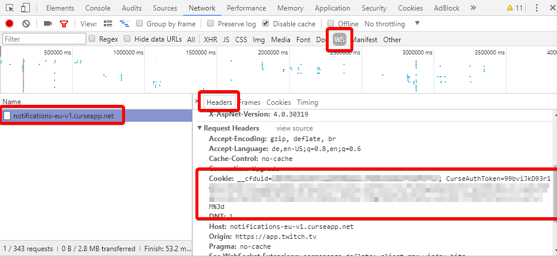
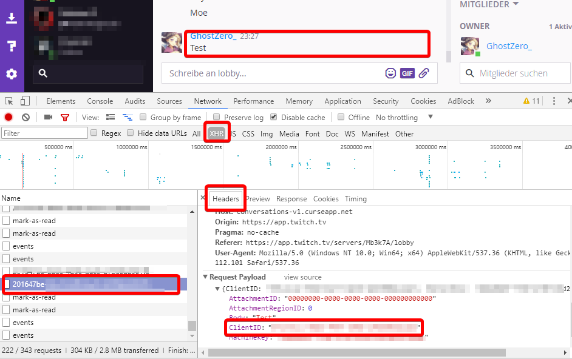

# Twitch Messenger API

## Setup

### Enable Debug Console

Push `F12` in your Twitch App (opens debug mode) and press `F5` to reload your client then navigate to your network tab.

### Get UserID, MachineKey & SessionId



### Get AuthToken

Parse the Auth Token from the Cookie: ...; CourseAuthToken=`AuthToken` and decode with https://urldecode.org/



### Get ClientId



## Example

```java
TwitchMessenger messenger = new TwitchMessenger(
       "userId",
       "clientId",
       "authToken",
       "machineKey",
       "sessionId"
);

messenger.setListener(new TwitchMessengerListener() {
    public void onMessage(TwitchConversation conversation, String message) {
        System.out.println("Message: " + message);
    }
});

messenger.connect();

// My example server: https://app.twitch.tv/servers/Mb3k7A
TwitchServer server = messenger.getServer("7b0d11d5-717a-4311-9f68-355897b10628");
TwitchConversation conversation = server.getConversation("201647be-8be5-4b99-bac9-b7266ba561f6");

conversation.sendMessage("Hello World!");

Scanner s = new Scanner(System.in);
while (s.hasNext()) {
    String line = s.nextLine();
    if(line.equals("exit") || line.equals("end")) {
        System.exit(0);
    } else {
        conversation.sendMessage(line);
    }
}
```